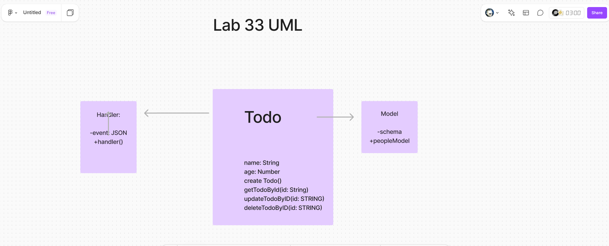

# Todo App

A simple todo application built using Vite.

## Table of Contents

- [Todo App](#todo-app)
  - [Table of Contents](#table-of-contents)
  - [Features](#features)
  - [Getting Started](#getting-started)
  - [Running the Application](#running-the-application)
  - [Configuration](#configuration)
  - [Testing](#testing)
  - [Troubleshooting](#troubleshooting)
  - [License](#license)

## Features

- Add, update, and delete tasks.
- Mark tasks as complete or incomplete.
- Filter tasks by status.

## Getting Started

### Prerequisites

- Node.js (v14 or later)
- npm (v6 or later) or Yarn (v1.22 or later)

### Installation

1. Clone the repository:
    ```bash
    git clone https://github.com/yourusername/todo-app.git
    cd todo-app
    ```

2. Install dependencies:
    ```bash
    npm install
    # or
    yarn install
    ```

## Running the Application

To start the development server, run:
```bash
npm run dev
# or
yarn dev
```

